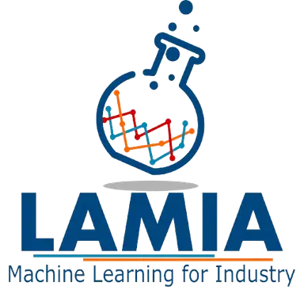
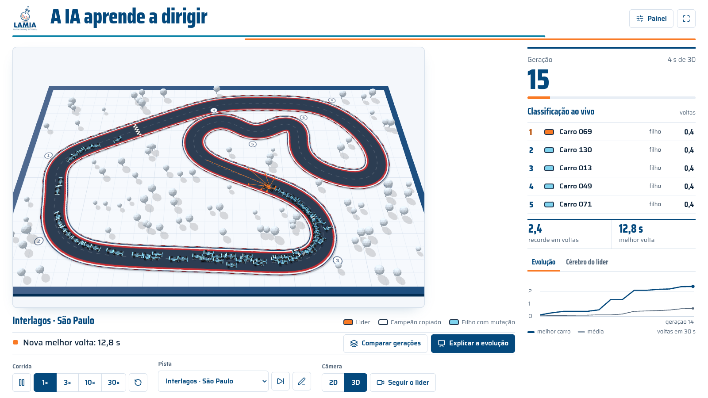
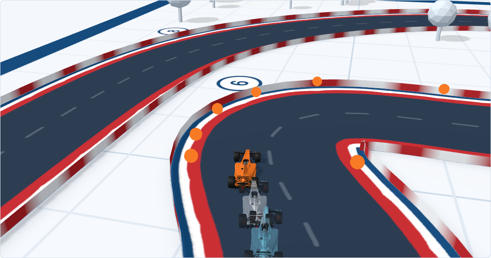
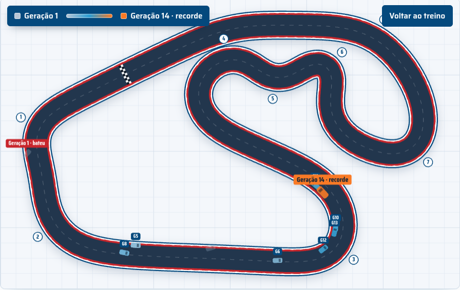
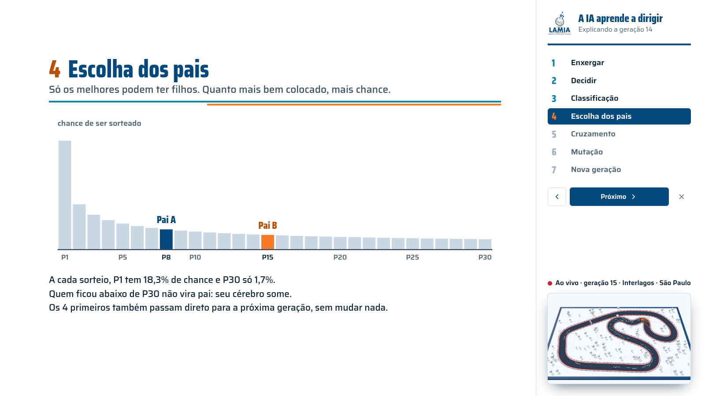

<div align="center">



# A IA aprende a dirigir

**150 carros, nenhum sabe dirigir. A cada 30 segundos, os melhores viram pais, e a próxima geração dirige melhor.**

Demo de neuroevolução do **LAMIA (Machine Learning for Industry)** para feiras de profissões.
Circuitos reais da F1 2026, maquete 3D, apresentação de slides embutida. Roda offline, num arquivo só.



</div>

---

## O que acontece na tela

Ninguém programou como fazer a curva. Cada carro tem:

1. **Olhos:** 7 sensores que medem a distância até a borda da pista.
2. **Cérebro:** uma rede neural pequena (8 entradas → 10 neurônios → 2 saídas) que transforma o que ele vê em **volante** e **acelerador**. Na geração 1, os pesos são sorteados ao acaso.
3. **Evolução:** depois de 30 segundos (ou quando todos batem), os que foram mais longe viram pais. Os filhos misturam os cérebros dos pais conexão por conexão e ganham pequenas mutações. Os 4 melhores passam direto, sem mudar.

Na primeira geração quase todos batem. Entre a 3ª e a 6ª alguém completa a primeira volta, e depois o tempo de volta continua caindo.

<table>
<tr>
<td width="50%"><br><sub><b>Câmera no líder (C):</b> as bolinhas laranja mostram onde cada sensor toca a borda.</sub></td>
<td width="50%"><br><sub><b>Comparar gerações (G):</b> o campeão de cada geração, do cinza (as primeiras) ao laranja (a recordista), na mesma pista.</sub></td>
</tr>
</table>

### Corrida entre alunos (tecla R)

Uma "roleta" com carros: de 1 a 30 participantes, cada um com nome e cor próprios, **todos com o mesmo cérebro** (o melhor treinado até agora). Quem ganha é a sorte: o motor de cada carro rende entre 92% e 100%, oscilando devagar ao longo da prova. Nas 240 corridas do teste de justiça, cada participante venceu perto de 1 em N vezes.

- **Grid com classificação:** uma volta lançada decide o grid, depois vêm as 5 luzes vermelhas.
- **Largada única:** todos saem juntos do mesmo ponto.
- **3, 5 ou 10 voltas.** Quem sai da pista volta parado, com 1 s de penalidade. Os carros não batem entre si.
- **Tela cheia da corrida (T):** transmissão estilo F1, com torre de posições (diferença para o líder alternando com intervalo), posições ganhas e perdidas desde a largada, relógio da prova, volta mais rápida em roxo, cartão do piloto em destaque (última volta, melhor volta, posição de largada, saídas de pista) e faixas de volta. Clique num nome da torre para a câmera seguir o carro.
- **Bandeirada:** pódio com o prêmio ("Ana ganhou um bombom!"), **Correr de novo** com sorte nova e os mesmos nomes, ou **Nova corrida**.

### Explicar a evolução (tecla E)

Uma apresentação de 7 slides feita **com os dados reais da última geração**: os raios de verdade do P1, a rede dele com os valores daquele instante, a classificação, a chance de cada posição virar pai, o filho pintado com as conexões de cada pai e as mutações com os valores de antes e depois. A pista continua rodando ao vivo no canto.



---

## Rodar

Precisa de Node 22 ou mais novo.

```bash
npm install
npm run dev      # http://localhost:5173
npm test         # testes do motor, incluindo o teste de aprendizado (~20 s)
npm run build    # dist/index.html: um arquivo só, abre com duplo clique, sem internet
```

O build embute JavaScript, CSS, fontes e o logo num único `index.html`. Dá para levar só esse arquivo num pendrive.

Para repetir uma execução boa, abra `index.html?seed=NÚMERO&pista=ID` (por exemplo `?seed=3&pista=br-1940`). A seed atual aparece no **Painel** (tecla P).

## Na feira

### Atalhos

| Tecla | Ação |
|---|---|
| **Espaço** | pausar / continuar |
| **1 2 3 4** | velocidade 1×, 3×, 10×, 30× |
| **R** | corrida entre alunos |
| **T** | tela cheia da corrida, com gráficos de TV (Esc sai) |
| **E** | explicar a evolução (→ ← passam os slides, Esc fecha) |
| **G** | comparar gerações |
| **C** | câmera seguindo o líder (ou o carro escolhido) |
| **V** | vista 2D ou maquete 3D |
| **N** | próxima pista, mantendo os cérebros |
| **F** | tela cheia para a TV (Esc sai) |
| **P** | painel do apresentador: experimentos, cérebro campeão, seed |

Clique em qualquer carro, na pista ou na classificação, para ver o cérebro dele.

### Antes de abrir o estande

1. Treine um campeão: deixe em 30× por uns 2 minutos, apertando **N** algumas vezes. Um cérebro que treinou numa pista só costuma decorar o caminho.
2. No **Painel** (P): **Guardar o melhor de agora** e depois **Exportar**, para ter um backup no pendrive.
3. Clique em **Do zero** (a seta circular na barra) e aperte **F**.

### Roteiro de 2 minutos

- **0:00 · Geração 1.** "Cada carrinho tem um cérebro sorteado ao acaso. Ninguém ensinou a dirigir. Olha: quase todos batem." Quando a geração acabar, aperte **E** e passe os slides no seu ritmo.
- **0:30 · Os olhos.** Aperte **C**: a câmera vai para trás do líder. "Essas bolinhas são o que ele enxerga." Volte com **C** e clique no carro laranja para mostrar o cérebro.
- **1:00 · O gráfico.** Quando alguém completar a primeira volta (o boletim avisa): "Ninguém mexeu no código. Só guardamos os melhores e deixamos eles terem filhos."
- **1:20 · Pista nova.** Aperte **N**. "Pista que eles nunca viram. Se continuarem andando, aprenderam a dirigir, e não só a decorar."
- **1:40 · Comparar gerações.** Aperte **G**. "Cada carro é o campeão de uma geração. Os cinzas batem logo; os azuis vão cada vez mais longe. É isso que é aprender."

Só 1 minuto? No **Painel**: **Correr com o campeão na próxima pista**.

Fim de apresentação com um grupo? Aperte **R**, digite os nomes e deixe a sorte decidir quem leva o bombom.

---

## Por dentro

| | |
|---|---|
| **Stack** | Vite, React e TypeScript. Canvas 2D e three.js para a maquete 3D. Vitest nos testes. Sem backend. |
| **Motor** | `src/engine/`: TypeScript puro, sem DOM. Roda igual no navegador e no Node. |
| **Aleatoriedade** | PRNG com seed (mulberry32): mesma seed e mesma pista dão a mesma corrida. |
| **Desempenho** | 150 carros × 30 passos por quadro em ~4 ms. Carros 3D instanciados: poucas chamadas de desenho para a frota inteira. |
| **Calibração** | Todos os parâmetros ficam em `params.ts`. O teste de aprendizado roda 15 gerações em 3 seeds e falha se a demo ficar fácil ou difícil demais. |

### Circuitos

17 dos 24 circuitos do calendário 2026, a partir dos traçados de [bacinger/f1-circuits](https://github.com/bacinger/f1-circuits) (MIT). Na escala da tela, cada traçado é suavizado só o necessário para ser pilotável. Ficam de fora Mônaco, Suzuka, Baku, Jeddah, Xangai, Miami e Madring: os grampos são impossíveis e os trechos paralelos se fundem, e suavizados até dar para correr eles viram uma gota irreconhecível.

A demo começa em **Monza**, a mais confiável nos testes (6 de 6 seeds completam volta até a geração 6).

```bash
node --experimental-transform-types scripts/build-circuits.ts scripts/f1-circuits.geojson   # regenera src/engine/circuits.ts
node --experimental-transform-types scripts/check-circuits.ts <circuitos.json>             # mede o aprendizado por circuito
node --experimental-transform-types scripts/check-race.ts it-1922 20 0.08                  # calibra a sorte da corrida
```

Às vezes uma população empaca numa curva, em qualquer pista. Se passar da geração 12 sem nenhuma volta, aperte **Do zero**.

### Organização

```
src/
  engine/   rede neural, genética, pista, física do carro, simulação, corrida, parâmetros
  render/   mapa 2D, carros, slides, rede, gráfico, maquete 3D e modelo do carro
  ui/       controlador (demo.ts) e componentes React
tests/      testes do motor e o teste de aprendizado
scripts/    geração e validação dos circuitos F1
```

`PRODUCT.md` descreve para quem é a demo. `DESIGN.md` descreve o sistema visual: o "dossiê oficial de corrida" na identidade LAMIA.

## Créditos

- **LAMIA · Machine Learning for Industry**: identidade visual e logo.
- Traçados dos circuitos: [bacinger/f1-circuits](https://github.com/bacinger/f1-circuits), MIT © Tomislav Bacinger.
- Fontes [Saira e Saira Condensed](https://fonts.google.com/specimen/Saira) (SIL Open Font License), empacotadas via Fontsource.
- [three.js](https://threejs.org) e [Lucide](https://lucide.dev) (ícones).

## Licença

Código sob a licença [MIT](LICENSE): use, estude e adapte à vontade. O nome, o logo e a identidade visual do LAMIA **não** entram na licença, pois pertencem ao laboratório (veja [NOTICE](NOTICE)).
